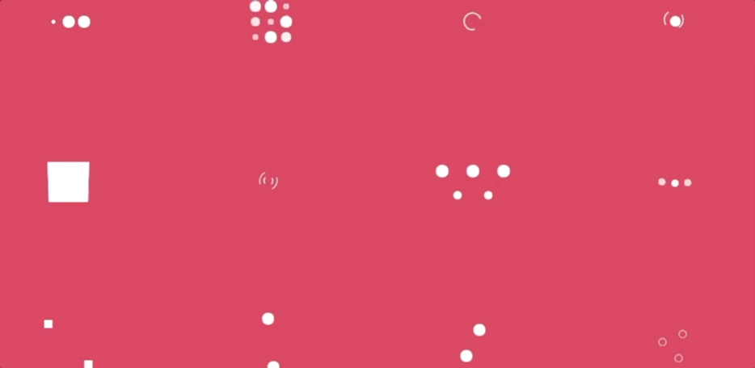
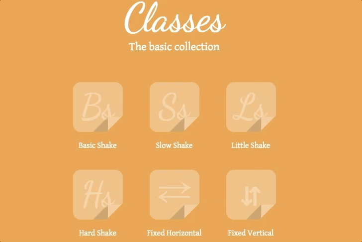
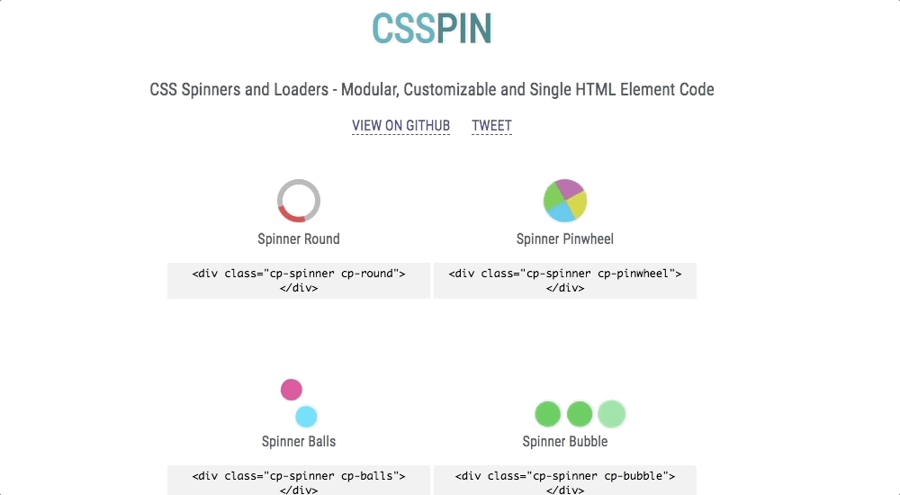

# CSS-Frameworks
Some cool CSS I've come across

## 1. [Paper CSS](https://www.getpapercss.com/): For Simple UI

## 2. [RPGUI](http://ronenness.github.io/RPGUI/): The GameArt UI

## 3. [Block CSS](https://thesephist.github.io/blocks.css/) : For that blockiness in your UI

## 4. [NES.css](https://nostalgic-css.github.io/NES.css/): The Nostalgic,Retro CSS

##  5. [PSone.css](https://micah5.github.io/PSone.css/): Playstation 1 Style CSS, Inspired from NES.css

   "

## 6. [Hover.css](http://ianlunn.github.io/Hover/): For Hover Transitions
--> [Github Link](https://github.com/IanLunn/Hover)

  

## 7. [voxel.css](http://voxelcss.com/):  A lightweight 3D CSS voxel library.

  
## 8. [Animate.css](https://animate.style/): Just Animate Stuff

 
  
## 9. [SpinKit](https://tobiasahlin.com/spinkit/): For some cool loading pages  
--> [Github Link](https://github.com/tobiasahlin/SpinKit)

## 10. [Effeckt.css](https://h5bp.org/Effeckt.css/): Some transitions

## 11. [Loaders.css](https://connoratherton.com/loaders): Delightful and performance-focused pure css loading animations.

## 12. [Primer CSS](https://primer.style/)

## 13. [Hint.css](https://kushagra.dev/lab/hint/): For Tooltips

## 14. [ CSS SHAKE ](https://elrumordelaluz.github.io/csshake/) : Some CSS classes to move your DOM!

## 15. [98.css](https://jdan.github.io/98.css/): A design system for building faithful recreations of old UIs

## 16.[ The Simpsons in CSS ](http://pattle.github.io/simpsons-in-css/)

## 17. [css.gg](https://css.gg/): Open-source CSS, SVG and Figma UI Icons

## 18. [Markdown.css](https://mrcoles.com/demo/markdown-css/): CSS for making regular HTML look like plain-text markdown.

## 19. [CSSPIN](https://webkul.github.io/csspin/)

   
## 20. [Toggles.css](https://jnkkkk.github.io/MoreToggles.css/):   A Pure CSS library that provides you with stylish toggles.

## 21. [Terminal CSS](https://terminalcss.xyz/) : A modern and minimal CSS framework for terminal lovers.

## 22. [Tufte CSS](https://edwardtufte.github.io/tufte-css/): Style web articles using the ideas demonstrated by Edward Tufte’s books and handouts.

## 23. [pure.css](https://purecss.io/)
][Pure]
A set of small, responsive CSS modules that you can use in every web project.
(http://purecss.io/)[Pure]

## An EXTRA 5%

1.[basscss](https://basscss.com/) - Low-level CSS Toolkit – the original Functional/Utility/Atomic CSS library

2.[Balloon.css](https://kazzkiq.github.io/balloon.css/) - Simple tooltips made of pure CSS

3.[Icono](https://saeedalipoor.github.io/icono/): Pure CSS Icons

4.[Instagram.css](https://picturepan2.github.io/instagram.css/) - Complete set of Instagram filters in pure CSS

5.[Imagehover.css](http://imagehover.io/): Pure CSS Image Hover Effect Library

6.[Crayon.css](https://riccardoscalco.it/crayon/): list of css variables linking color names to hexadecimal values, usable with postCSS or with your favourite CSS    preprocessor

7.[Pushy Buttons](https://iraul.github.io/pushy-buttons/):A small CSS Pressable Buttons library.

8. [Silon](https://silon.slaks.net/#gates): Adders and Logic Gates in Pure CSS

Also CheckOut:

https://github.com/troxler/awesome-css-frameworks

https://github.com/uhub/awesome-css

The normal Frameworks

1.[Bootstrap](https://getbootstrap.com/)
2.[Foundation](https://get.foundation/)
3.[Materialize CSS](https://materializecss.com/)
4.[Bulma](https://bulma.io/)
5.[Semantic UI](https://semantic-ui.com/)
6.[UIKit](https://getuikit.com/)

